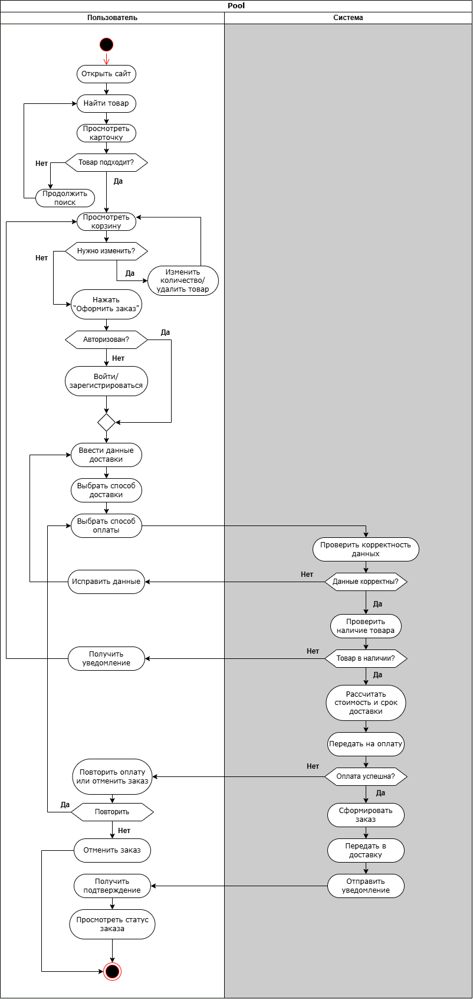

# 1.2. Детальный анализ ключевого процесса (оформление заказа)

Процесс оформления заказа — один из самых важных пользовательских сценариев на Wildberries. Он включает взаимодействие пользователя и системы, несколько точек принятия решений, проверку данных, работу с корзиной, авторизацию и обработку альтернативных сценариев (ошибки оплаты, отсутствие товара, проблемы с данными доставки).

## Передаваемые данные на каждом этапе

| Этап                        | От кого       | Что передаётся                                              | Кому         |
|-----------------------------|---------------|-------------------------------------------------------------|--------------|
| Поиск и просмотр товара     | Пользователь  | Поисковый запрос, выбор категории, фильтры                  | Система      |
|                             | Система       | Список товаров с характеристиками, данные карточки товара (цена, фото, рейтинг, наличие) | Пользователь |
| Авторизация                 | Пользователь  | Данные для входа или регистрации (телефон, код, пароль)    | Система      |
|                             | Система       | Статус авторизации (успешно / ошибка)                      | Пользователь |
| Работа с корзиной           | Пользователь  | Добавление/изменение товара (ID товара, размер, количество) | Система      |
|                             | Система       | Обновлённая корзина, итоговая стоимость, доступность товаров | Пользователь |
| Оформление заказа           | Пользователь  | Данные доставки, способ доставки и способ оплаты            | Система      |
|                             | Система       | Результат проверки данных, наличие товара, итоговая стоимость | Пользователь |
| Оплата                      | Пользователь  | Платёжные данные (карта, СБП, WB-кошелёк и др.)            | Система      |
|                             | Система       | Статус оплаты (успешно / ошибка)                           | Пользователь |
| Завершение заказа           | Система       | Подтверждение заказа, номер заказа, статус, уведомление (push/SMS/email) | Пользователь |

## UML-диаграмма активности

Для визуализации процесса оформления заказа используется следующая диаграмма активности (Activity Diagram):

**Файл:** `activity_diagram.png`

## Критические точки процесса:
- Этап оплаты → высокий drop-off из-за ошибок
- Этап корзины → потеря товаров при сбоях
- Этап доставки → недоверие из-за неопределённости сроков
